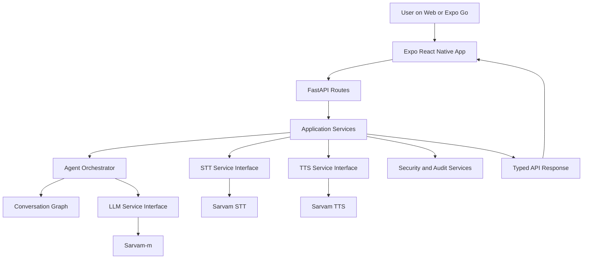

# Saarthi Live 

Saarthi Live is an Expo + FastAPI prototype for multilingual live discussion, resume-led interviewing, AI resume creation, and candidate profile analysis. The AI path uses Sarvam for speech recognition, Sarvam-m as the LLM brain, and Sarvam TTS for spoken responses.

The app runs on:

- Expo Web for laptop testing
- Expo Go on Android
- Android Emulator through Expo

## Core Features

- General AI Assistant Mode for natural multilingual discussion.
- Resume Upload Interview Mode that starts only after a resume is uploaded or created.
- Hindi Consultant Resume Builder for local workers and professionals.
- Resume output in both Hindi and English.
- Candidate Profile page generated from live discussion turns.
- Sarvam STT auto-detection for Indian languages.
- Sarvam-m structured agents for resume analysis, resume generation, and profile analysis.
- SOLID-style backend with FastAPI routes, application services, service interfaces, agent orchestration, and governance services.

## Architecture



Public backend routes are stable:

- `GET /health`
- `GET /handoff-tone`
- `GET /tts`
- `POST /speech/transcribe`
- `POST /text-turn`
- `POST /voice-turn`
- `POST /resume/analyze`
- `POST /resume/build`
- `POST /resume/download`
- `POST /candidate/profile`
- `POST /token`
- `GET /security/status`

## Backend Layout

```text
backend/
  api/
    routes_profile.py
    routes_resume.py
    routes_system.py
    routes_voice.py
  services/
    agent_orchestrator.py
    application.py
    document_parser.py
    governance.py
    interfaces.py
    sarvam.py
  tests/
    test_refactor_smoke.py
  agent.py
  conversation_graph.py
  pydantic_agents.py
  schemas.py
  security.py
  token_server.py
```

## Setup

Install JavaScript dependencies:

```powershell
cd C:\Users\anuja_9ipoxfr\Downloads\Projects\testvoice-agent
npm install
```

Prepare backend:

```powershell
cd C:\Users\anuja_9ipoxfr\Downloads\Projects\testvoice-agent\backend
python -m venv .venv
.venv\Scripts\pip.exe install -r requirements.txt
copy .env.example .env
```

Edit `backend\.env` and add:

```text
SARVAM_API_KEY=...
LIVEKIT_URL=...
LIVEKIT_API_KEY=...
LIVEKIT_API_SECRET=...
SARVAM_LLM_MODEL=sarvam-m
SARVAM_TTS_SPEAKER=anand
```

## Run Backend

From repo root:

```powershell
cd C:\Users\anuja_9ipoxfr\Downloads\Projects\testvoice-agent
npm run backend:token
```

Health check:

```powershell
Invoke-RestMethod http://127.0.0.1:8787/health
```

## Run Web App

```powershell
cd C:\Users\anuja_9ipoxfr\Downloads\Projects\testvoice-agent
npx expo start --web --port 8084 -c
```

Open:

```text
http://localhost:8084
```

Use backend URL:

```text
http://localhost:8787
```

## Run Mobile App In Expo Go

```powershell
cd C:\Users\anuja_9ipoxfr\Downloads\Projects\testvoice-agent
npx expo start --host lan --port 8083 -c
```

Scan the QR code in Expo Go.

Use backend URL with your laptop LAN IP:

```text
http://YOUR-LAPTOP-LAN-IP:8787
```

Example:

```text
http://10.162.27.207:8787
```

## Verification

```powershell
backend\.venv\Scripts\python.exe -m unittest discover backend\tests
npx.cmd tsc --noEmit
backend\.venv\Scripts\python.exe -c "import sys; sys.path.insert(0, 'backend'); import token_server; print(token_server.app.title)"
```

## Documentation

- [Final Design Workflow](docs/final-design-workflow.md)
- [Runbook](docs/RUNBOOK.md)
- [Security Notes](docs/SECURITY.md)
- [GitHub Publishing Checklist](docs/GITHUB_PUBLISHING.md)
- [PDF Workflow](docs/final-design-workflow.pdf)

## Security Notes

The current prototype includes:

- Optional API token auth
- Configurable CORS
- Rate limiting
- Upload size limits
- File allowlists
- Basic unsafe upload marker checks
- PII redaction in logs
- Metadata audit trail
- Prompt-injection cleanup for resume/context text

It does not yet include production login, encrypted persistent storage, a real malware scanner, or full admin RBAC.


