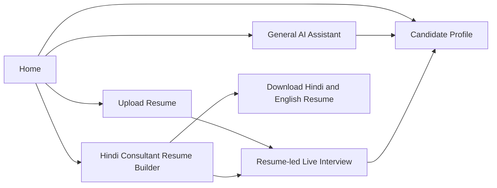
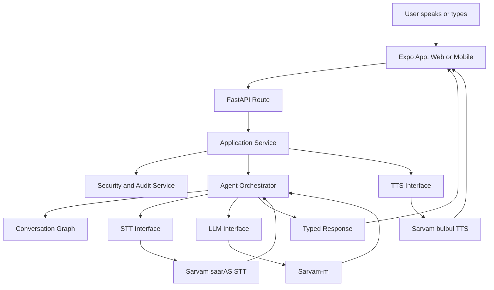
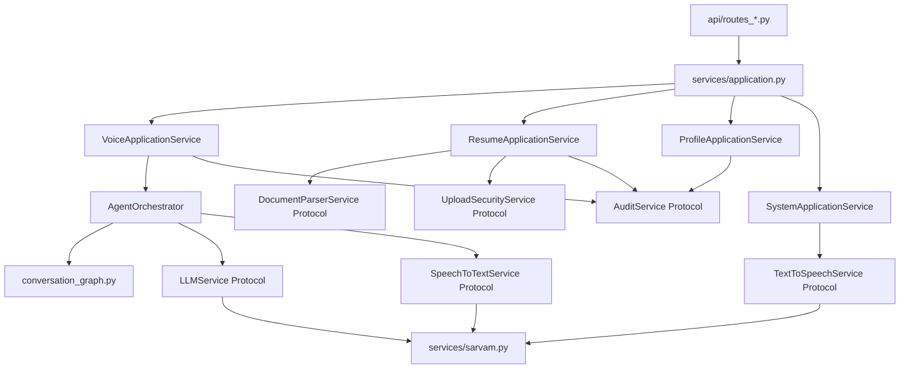
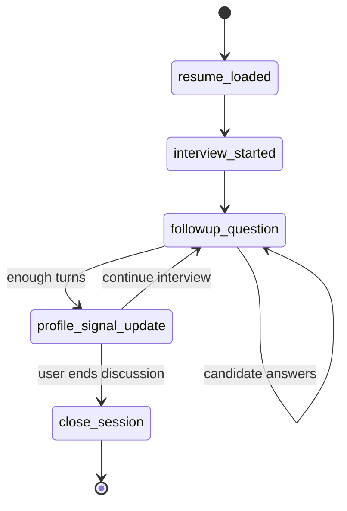
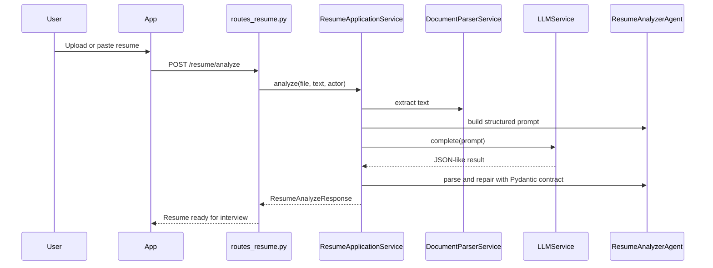
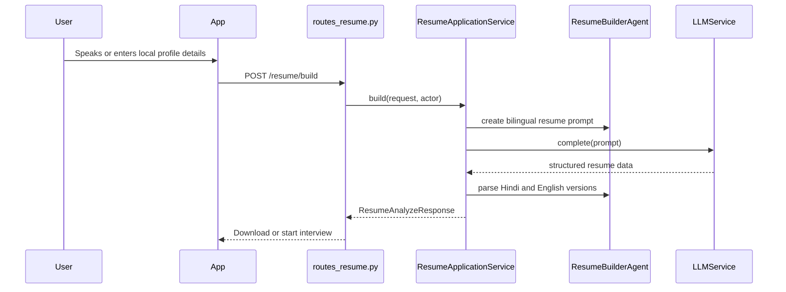
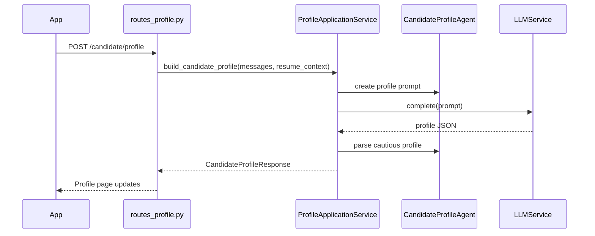
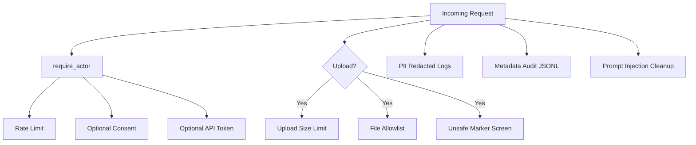

# Saarthi Live  Final Design Workflow

## Product Goal

Saarthi Live gives users a multilingual AI conversation experience that can shift between a general assistant, resume-led interview, Hindi resume creation, and candidate profile analysis without mixing unrelated memories across flows.

## User-Facing Modes

## End-To-End System Flow

## Backend SOLID Shape

## Interview State Machine

## Resume Upload Flow

## Hindi Resume Builder Flow

## Candidate Profile Flow

## Memory Boundaries

- General Assistant starts with fresh general memory.
- Resume-led interview starts with fresh interview memory.
- Resume context is carried into interview mode.
- Previous general assistant turns do not leak into interview history.
- Candidate Profile uses the current active discussion/interview memory.

## Security And Governance

## Current Limitations

- Expo Go uses short audio chunks, not native LiveKit streaming.
- Full LiveKit realtime voice requires a development build.
- No encrypted database because conversations are not persisted.
- No external malware scanner yet.
- No full identity provider/RBAC console yet.

